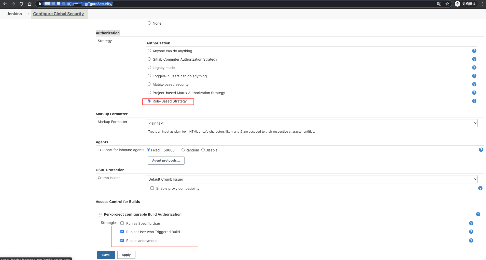
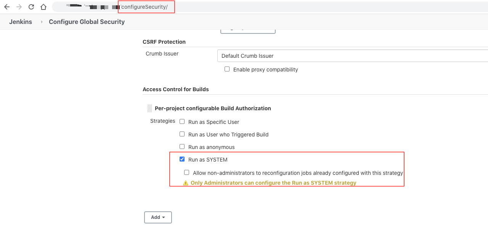

# Authorization Role-base-Strategy

Jenkins 2.235.1 + Authorize Project 1.3.0 + Role-based Authorization Strategy 3.0

## 安装插件

1. Authorize Project
1. Role-based Authorization Strategy

注意，Authorize Project 一定要选择 "重启后安装", 直接不重启安装会有很多问题，比如配置不了 Build Control, Project 没有 Authorization 配置选项等等.

## 配置 Authorization

## 配置 Global Security Configuration

注意，用如果这里不这样设置为 Run as System，会出现 "X" leaks permission to run on "Y" 的错误。

参考 issues: https://issues.jenkins-ci.org/browse/JENKINS-60508

## 角色与权限

### 创建角色与权限

#### Global role

这是全局用户的角色，一般类型的用户角色，把 Overall / read 勾选上就可以了。

[Global Role](./res/20200706171302.png)

#### Items role

我的 Jenkins 是 2.235.1 版本，只有 Items role，更早一点的版本，叫 Project role。

这个 role，主要是控制数据展示用，比如限制某个用户只能看到指定规则的项目，比如测试只能看测试的项目。

另外，需要说明下，这里的 Items role，有点问题: 如果只创建了指定规则 Role，就算把这个 role 分配给用户了，用户是看不到这些 role 里面的项目的。

解决这个问题的办法，是建 一个名称为 `all` 的 role，pattern 为 `.*`，不分配任何权限，并且把这个 role 分配的你的用户 user1，这样 user1 才

可以看到对应规则的项目，如果 Global 勾选了 job -> read 权限，那就会导致绑定了全局 role 的用户，有查看所有项目的权限了，无法·做到权限控制。

[Global Role](./res/20200706171427.png)

#### Nodes role

### 分配权限

分配权限需要注意添加角色大小写，如果你添加了用户/角色，并且设置了指定的权限，都无效，尝试把大小写都加一下试试。

比如用户 jenkins 添加了 admin 权限，但是无效。就再添加一个用户 Jenkins 的 admin 权限。
